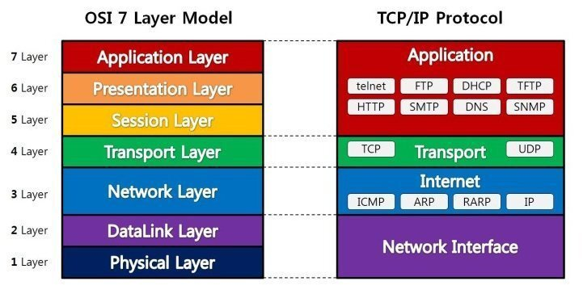
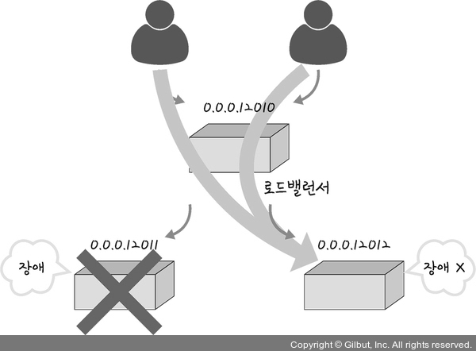

# 네트워크 기기
### 네트워크 기기의 처리 범위
- OSI 계층별로 처리 범위가 나뉜다.
- 상위 계층 기기의 하위 계층 처리는 가능하지만 반대는 불가능



## 애플리케이션 계층
### L7 스위치
- 로드밸런서(서버의 부하 분산) - 서버 이중화
- 바이러스, 불필요한 외부 데이터를 걸러내는 필터링
- 모니터링



##### ❓스위치 
```
여러 장비를 연결, 데이터 통신을 중재하며 목적지가 연결된 포트로만 전기 신호를 보내 데이터 전송
```
##### ❓L4 스위치와의 차이
```
공1) L7, L4 스위치 모두 로드밸런서
공2) 헬스 체크를 통해 반복적으로 서버에 요청을 보내는 방식으로 정상/비정상 서버 판별
차1) L4 스위치는 전송 계층 기기로 스트리밍 관련 서비스에서는 사용이 불가
차2) L4 스위치는 IP/포트 기반, L7 스위치는 IP/포트/URL/HTTP 헤더/쿠키 등 기반 트래픽 분산 처리
```
## 인터넷 계층
### 라우터
- 다른 네트워크에 있는 장치끼리 데이터를 주고받는 라우팅을 처리
- 패킷 소모 최소화, 경로 최적화, 최소 경로로 포워딩
### L3스위치
- L2 스위치의 기능 + 라우팅 기능(하드웨어 기반)

## 데이터 링크 계층
### L2 스위치
- MAC 주소 테이블로 MAC 주소 관리 (IP는 이해하지 못함)
- 연결된 장치로부터 패킷이 왔을 때 패킷 전송
### 브리지
- LAN 간 상호 접속을 가능케 하는 통신망 연결 장치 (다리 역할)

## 물리 계층
### NIC(LAN 카드)
- Network Interface Card
### 리피터
- 약해진 신호 정도를 증폭하여 다른 쪽으로 전달
- 패킷이 더 멀리 갈 수 있도록 함
- 이는 광케이블 보급 이후 잘 쓰이지 않음
### AP
- Access Point
- 패킷을 복사
- AP에 유선 LAN을 연결한 후 다른 장치에서 무선 LAN을 사용하여 무선 네트워크 연결 가능


## 참고자료  
https://thebook.io/080326/0101/
https://shlee0882.tistory.com/110