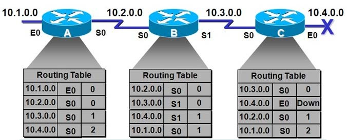
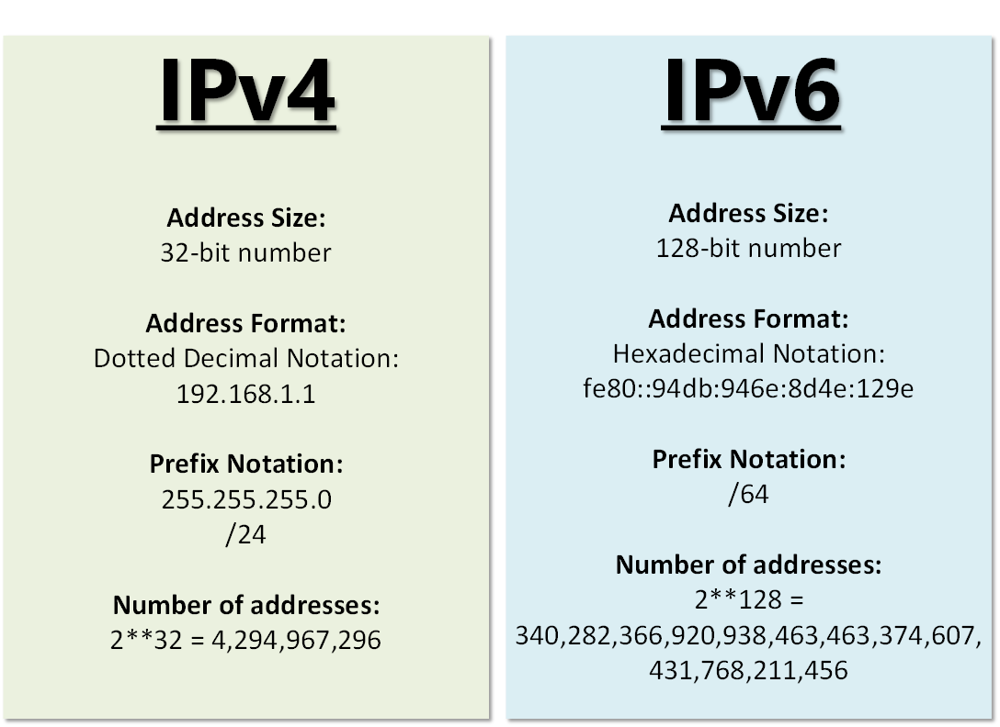
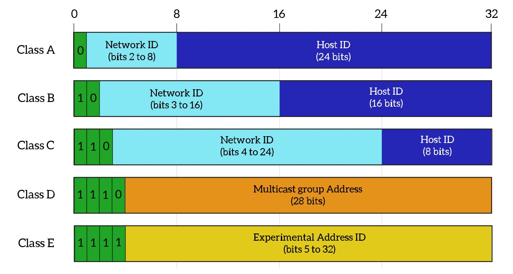
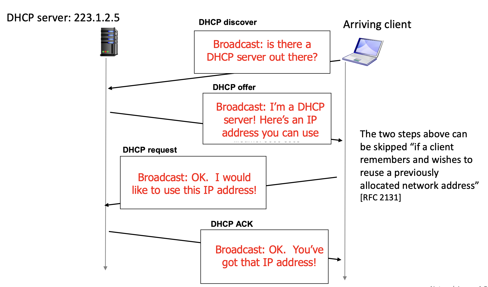
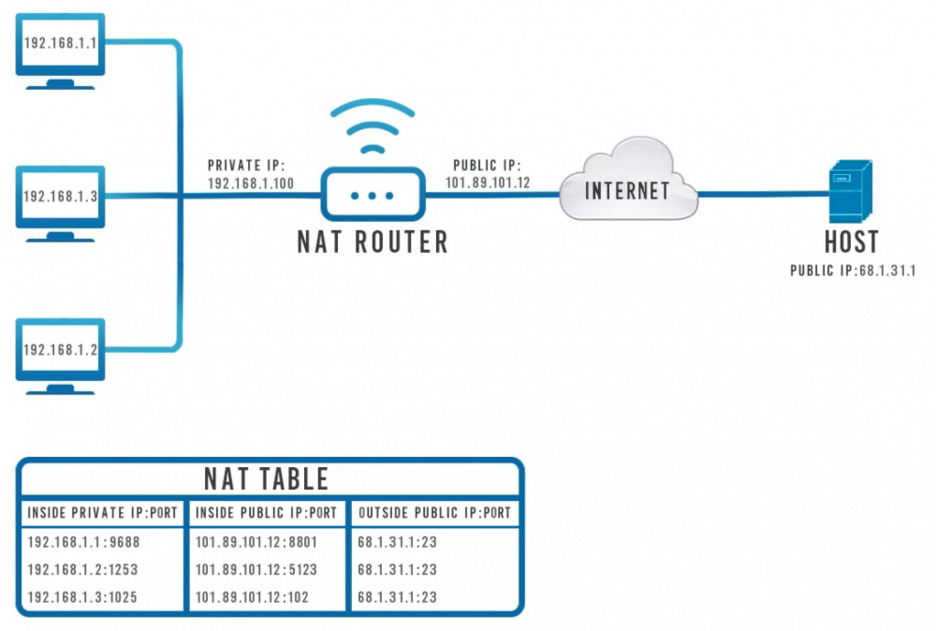

# IP 주소
### ARP
- IP 주소(가상)로부터 MAC 주소(실제)를 구하는 프로토콜
- ARP Request 브로드캐스트를 보내고 해당 IP를 가진 장치로부터 ARP Reply 유니캐스트를 받는다.

이 반대는 RARP로, MAC -> IP를 수행

##### ❓브로드캐스트와 유니캐스트 
```
브로드캐스트: 일대다 데이터 전송
유니캐스트: 일대일 데이터 전송
```

## 홉바이홉 통신
패킷이 라우터의 _라우팅 테이블 IP를 기반으로 여러 개의 라우터를 건너가(라우팅)_ 최종 목적지까지 전달되는 것

### 라우팅 테이블
- 목적지 정보, 그 목적지로 가기 위한 방법이 있는 리스트

<p align="center">
  
</p>

##### ❓라우팅과 포워딩
```
라우팅: 패킷의 출발지부터 목적지까지 경로 결정(최단 거리 알고리즘 이용)
포워딩: 입력 포트에서 출력 포트로 패킷을 전달
즉 라우팅 알고리즘을 통해 포워딩 테이블이 만들어지고 이를 참조하여 이동시킴
```
[라우팅vs포워딩 추가 자료](https://nenunena.tistory.com/52)

### 게이트웨이
- 네트워크 간 통신을 가능하게 하는 관문 역할을 하는 컴퓨터/소프트웨어
- 통신 프로토콜 변환
- netstat -r 명령어로 확인 가능

## IP 주소 체계
### IPv4
- 총 32bit, 점(.)으로 구분

### IPv6
- 총 128bit, 콜론(:)으로 구분

<p align="center">
  
</p>

## 클래스 기반 할당 방식
사용하는 주소보다 버리는 주소가 많은 단점이 있어 이를 해소하기 위해 DHCP, IPv6, NAT가 제시됨
<p align="center">
  
</p>


## DHCP
자동으로 IP 주소를 할당
<p align="center">
  
</p>

## NAT(Network Address Translation)
-  사설 네트워크에 속한 여러 개의 호스트가 하나의 공인 IP 주소를 사용하여 인터넷에 접속하도록 한다.
- 공인 IP와 사설 IP 간 변환으로 많은 주소를 처리할 수 있다.

#### 장점
1. **내부 네트워크 IP 주소에 대한 보안**
   - 내부 네트워크의 IP 주소를 외부에 노출하지 않음으로써 보안을 강화할 수 있다.
2. **공인 IP 주소 절약**

#### 단점
- **접속하는 호스트 숫자가 많아지면 접속 속도가 느려짐**
  - 많은 호스트가 동시 접속할 경우 NAT 장치의 부하가 증가하여 네트워크 성능이 저하될 수 있다.


<p align="center">
  
</p>

##### ❓IP masquerading
```
masquerading은 가장무도회를 의미하는데, 하나의 공인 IP 뒤로 여러 개의 사설 IP 를 은닉하는 NAT의 동작 원리를 설명하는 용어
```

### IP 주소를 이용한 위치 정보
- IP는 위치 정보를 담고 있다.

## 참고자료  
- https://enter.tistory.com/165
- https://inpa.tistory.com/entry/WEB-🌐-NAT-란-무엇인가