## 프로그램, 프로세스, 스레드  
프로그램 : 실행할 수 있는 파일  
프로세스 : 컴퓨터에서 실행되고 있는 프로그램. 프로그램이 RAM에 올라가 실행된다면 프로세스가 된다.  
스레드 : 프로세스 안에서 작업의 흐름
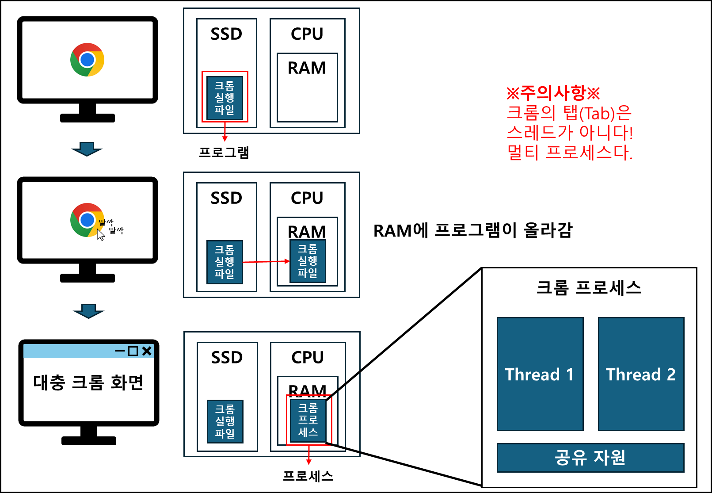
이후 CPU 스케쥴러에 따라 CPU가 프로세스를 실행한다.  

## 프로세스와 컴파일 과정
C언어 기반의 프로그램의 경우, 다음과 같은 절차를 통해 실행 파일을 만들게 된다.  
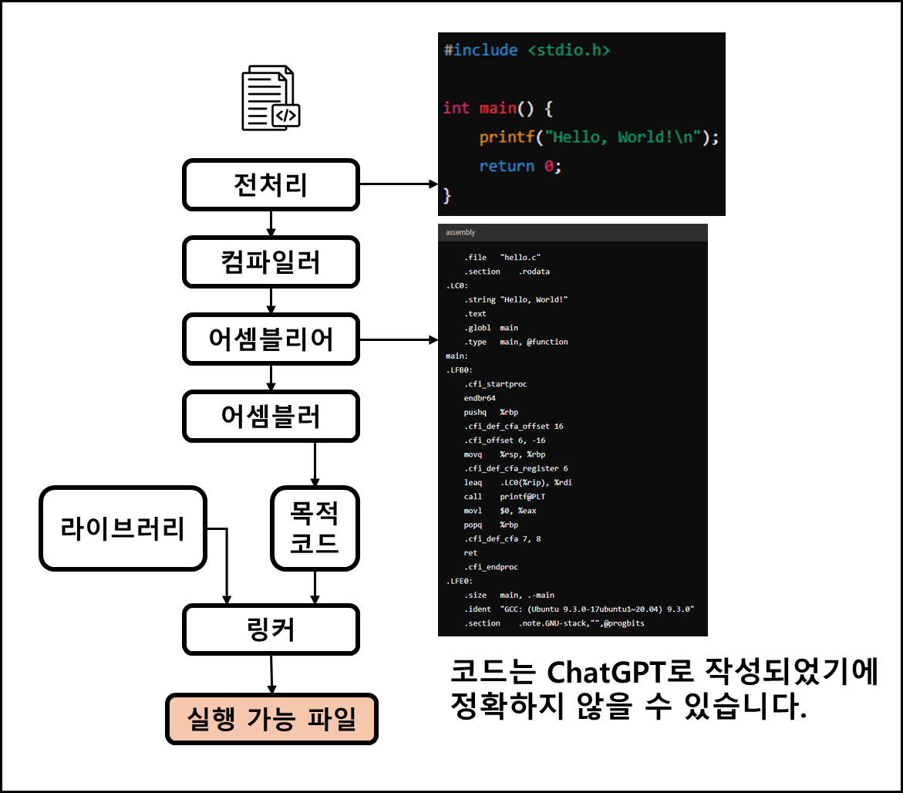

- 전처리  
소스 코드의 주석을 제거하고, #include 등 헤더 파일을 병합하여 매크로를 치환한다.  
- 컴파일러  
오류 처리, 코드 최적화 작업을 하고 어셈블리어로 변환한다.  
- 어셈블러  
어셈블리어를 목적 코드로 변환한다. 리눅스에서는 .o 파일이 생성된다.  
- 링커  
프로그램 내에 있는 라이브러리 함수 또는 다른 파일들과 목적 코드를 결합하여 실행파일을 만든다.  
확장자는 .exe 또는 .out을 갖는다.  

### 정적 라이브러리, 동적 라이브러리
- 정적 라이브러리  
프로그램 빌드 시 라이브러리가 제공하는 모든 코드를 실행파일에 넣는 방식  
- 동적 라이브러리  
프로그램 실행 시 필요할 때만 DLL이라는 함수 정보를 통해 참조하여 라이브러리를 쓰는 방식  

||장점|단점|
|:--:|:--:|:--:|
|정적 라이브러리|시스템 환경 등 외부 의존도 ⬇️|코드 중복/메모리 효율성 ⬇️|
|동적 라이브러리|메모리 효율성 ⬆️|외부 의존도 ⬆️
## 프로세스의 메모리 구조
프로세스에 적절한 메모리를 할당하는데 다음 구조를 기반으로 할당한다.
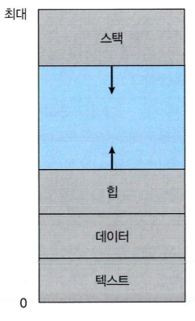
### 동적 영역
주소 공간은 대략적으로 위 그림처럼 생겼다.
Stack
- 함수의 호출과 관계되는 지역 변수와 매개 변수가 저장되는 영역
- Stack 영역의 값은 함수 호출과 함께 할당, 호출 완료시 소멸

Heap
- 런타임에 크기가 결정되는 영역
- 사용자에 의해 공간이 동적으로 할당 및 해제
- malloc(), free() 함수를 통해 관리한다.
### 정적 영역
Data
- 전역 변수, Static 변수 등 프로그램이 사용할 수 있는 데이터를 저장하는 영역
- 프로그램의 시작과 함께 할당, 프로그램이 종료되면 소멸
- BSS segment와 Data segment로 나뉘어 진다.
  ##### BSS segment
  - 0으로 초기화 또는 초기화가 어떠한 값으로도 되어 있지 않은 변수들이 이 메모리 영역에 할당
  ##### Data segment
  - 0이 아닌 값으로 초기화된 변수들이 이 메모리 영역에 할당  

Text(Code)
- CPU가 해석 가능한 기계어 코드가 저장되어 있는 공간
## PCB (Process Control Block)
운영체제에서 프로세스에 대한 메타데이터를 저장한 '데이터'(자료 구조)  
프로세스가 생성되면 운영체제는 PCB를 생성한다.  

프로그램 실행 -> 프로세스 생성 -> 프로세스 메모리 할당 (Stack, Heap, etc) -> 프로세스의 메타데이터가 PCB에 저장  
PCB는 프로세스의 중요한 정보를 포함하고 있어 커널 스택의 가장 앞부분에서 관리된다.  
### PCB의 구조
|||
|:--:|:--:|
|프로세스 상태|Create, Ready, Blocked 등 상태|
|프로세스 ID|프로세스의 ID/자식 프로세스의 ID|
|프로세스 권한|컴퓨터 자원 또는 I/O 디바이스에 대한 권한 정보|
|프로그램 카운터|프로세스에서 실행해야 할 다음 명령어의 주소에 대한 포인터|
|CPU 레지스터|프로세스를 실행하기 위해 저장해야 할 레지스터에 대한 정보|
|CPU 스케쥴링 정보|CPU 스케줄러에 의해 중단된 시간 등에 대한 정보|
|계정 정보|프로세스 실행에 사용된 CPU 사용량, 실행한 유저의 정보|
|I/O 상태 정보|프로세스에 할당된 I/O 디바이스 목록|

## 프로세스의 상태  
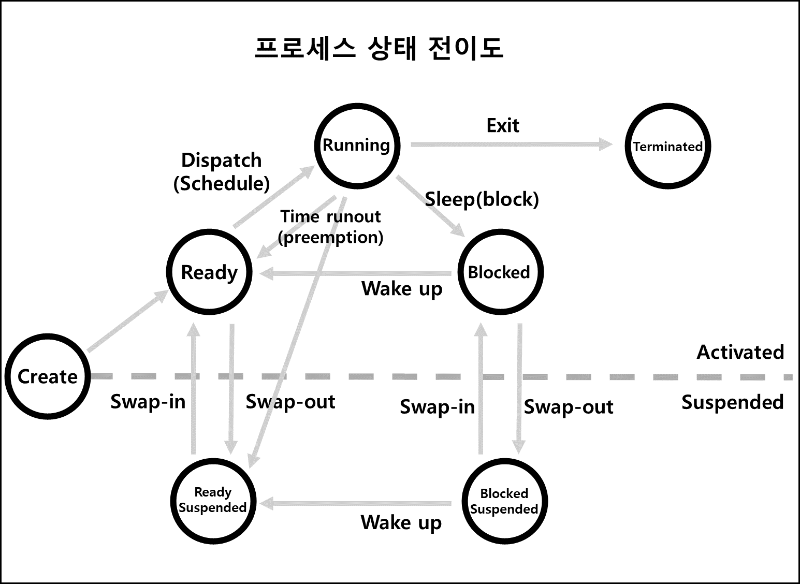
### 생성 상태 (Create)  
- 프로세스가 생성된 상태
- fork() 또는 exec()함수를 통해 생성
- PCB 할당  

#### fork()
```
부모 프로세스의 주소 공간을 그대로 복사하며, 새로운 자식 프로세스를 생성하는 함수
주소 공간만 복사하기 때문에, 부모 프로세스의 비동기 작업 등을 상속하지 않는다.
```

#### exec()
```
현재 프로세스를 새로운 프로세스로 교체하는 함수
주로 fork()와 exec()은 함께 사용된다.
```
### 대기 상태 (Ready)
- 필요한 자원(메모리)을 모두 할당받은 상태
- CPU 스케줄러로 부터 CPU 소유권이 넘어오면 실행 상태로 변경
- 대기 상태 -> 실행 상태로 가는 것을 Dispatch 또는 Schedule 되었다고 한다.

### 대기 중단 상태 (Ready Suspended)
- 준비 상태에 있던 프로세스가 기억장치를 빼앗긴 상태
- 실행 상태에 있던 프로세스가 선점되어 대기 중단 상태로 전이될 수 있다.
- 대기 상태 -> 대기 중단 상태로 전이 되는 것을 지연(Suspend) 또는 Swap-out이라 한다.
- 대기 중단 상태 -> 대기 상태로 전이 되는 것을 재활동(Resume) 또는 Swap-in이라 한다.

### 실행 상태 (Running)
- CPU 소유권을 받아 인스트럭션을 수행 중인 상태를 의미한다.
- 시간 할당량이 끝(Time runout)나거나, 우선 순위가 높은 프로세스가 선점(Preemption)에 의해 프로세스가 반납될 수 있다.
- 프로세스 실행 중 자원 요청이 들어오면 중단 상태(Block)로 전이된다.

### 중단 상태 (Blocked)
- 어떤 이벤트가 발생한 이후 기다리며 프로세스가 차단된 상태
- 자원을 요청후 할당받을때 까지 기다리는 상태
- 주로 I/O 디바이스에 의한 인터럽트로 발생한다.
- 이벤트 완료 및 자원 할당을 받을 시 다시 준비상태로 전이(Wake up)

### 일시 중단 상태 (Block Suspended)
- 대기 상태에서 기억장치를 잃은 프로세스
- 다시 기억장치를 할당 받으면 대기 상태로 전이된다.

### 종료 상태 (Terminated)
- 메모리와 CPU 소유권을 모두 놓고 가는 상태
- 자연스럽게 종료되는 경우
- 자식 프로세스에 할당된 자원의 한계치를 넘어 부모 프로세스가 종료되는 경우
- process.kill 등 명령어로 프로세스를 종료하는 경우
---
### 컨텍스트 스위칭  
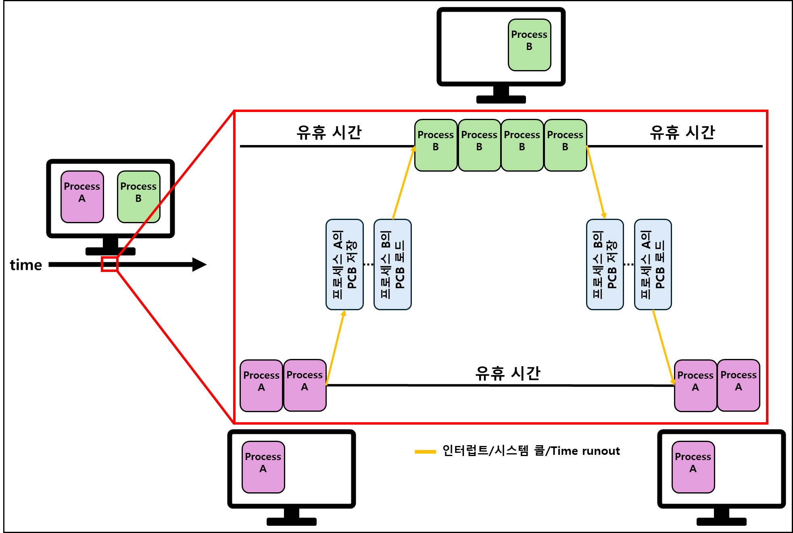
- PCB를 교환하는 과정  
- 한 프로세스에 할당된 시간이 끝나거나(Time runout) 인터럽트, CPU 선점에 의해 발생  
- 어떤 시점에서 실행되고 있는 프로세스는 단 한 개  
  - 현대 컴퓨터는 멀티코어 CPU를 가지기 때문에 한 시점에 한 프로그램은 틀린 설명이나, 컨텍스트 스위칭을 설명할 때에는 싱글코어를 기준으로 설명
  - 많은 프로세스가 동시에 구동되는 것 처럼 보이는 이유는 컨텍스트 스위칭이 아주 빠르게 실행되기 때문  
  - 
- 컨텍스트 스위칭이 일어날 때 유휴 시간(idle time)이 발생

#### 비용: 캐시미스
- CPU가 필요한 데이터를 캐시에서 찾지 못하고 메인 메모리에서 가져올 때 발생
  - Compulsory Miss: 캐시에 데이터가 처음 로드될 때 발생
  - Conflict Miss: 캐시에 할당된 공간이 충돌을 일으킬 때 발생
  - Capacity Miss: 캐시 용량이 부족하여 발생

#### 스레드에서의 컨텍스트 스위칭
- 스레드에서도 컨텍스트 스위칭 발생
- 스택 영역을 제외한 모든 메모리를 공유
- 프로세스 컨텍스트 스위칭에 비해 적은 비용, 적은 시간 사용

## 멀티 프로세싱  
- 여러 개의 '프로세스', 즉 멀티프로세스를 통해 동시에 두 가지 이상의 일을 수행할 수 있는 것  
- 하나 이상의 일을 병렬로 처리할 수 있다.
- 특정 프로세스에 문제가 발생하더라도 다른 프로세스를 이용해 처리할 수 있다.
  - 신뢰성이 높다.

### 웹 브라우저
#### 브라우저 프로세스
- 주소 표시줄, 북마크 막대, 뒤로 가기 버튼, 앞으로 가기 버튼 등을 담당
- 네트워크 요청이나 파일 접근 같은 권한 담당
#### 렌더러 프로세스
- 웹 사이트가 '보이는' 부분의 모든 것을 제어
#### 플러그인 프로세스
- 웹 사이트에서 사용하는 플러그인을 제어
#### GPU 프로세스
- GPU를 이용해서 화면을 그리는 부분을 제어

### IPC
Inter Process Communication의 약자  
프로세스끼리 데이터를 주고받고 공유 데이터를 관리하는 매커니즘  
#### IPC의 종류
- 공유 메모리
- 파일
- 소켓
- 익명 파이프
- 명명 파이프
- 메시지 큐

#### 공유 메모리
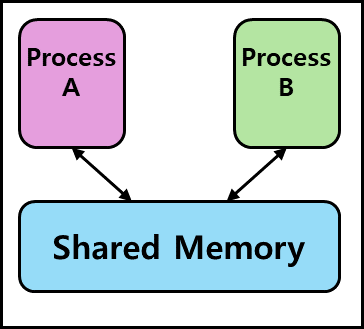
- 여러 프로세스에 동일한 메모리 블록에 대한 접근 권한이  부여  
- 프로세스가 서로 통신할 수 있도록 공유 메모리를 생성해서 통신  
- 공유 메모리를 통해 여러 프로세스가 하나의 메모리를 공유할 수 있다.
- 메모리 자체를 공유하기 때문에 불필요한 데이터 복사의 오버헤드가 발생하지 않아 가장 빠르다.
- 같은 메모리 영역을 여러 프로세스가 공유하여 동기화가 필요하다.
- 하드웨어 관점에서 공유 메모리는 RAM을 가리키기도 한다.

#### 파일
- 디스크에 저장된 데이터 또는 파일 서버에서 제공한 데이터
- 파일을 기반으로 프로세스간 통신  

🤔씅's Think
```
파일에 read/write를 통해 통신을 진행하기 때문에
file I/O 오버헤드가 발생할 것 같다.
```

#### 소켓
- 동일한 컴퓨터의 다른 프로세스나 네트워크의 다른 컴퓨터로 네트워크 인터페이스를 통해 전송하는 데이터
- TCP/UDP

#### 익명 파이프
- 프로세스 간에 FIFO 방식으로 읽히는 임시 공간인 파이프를 기반으로 데이터를 주고 받는다.
- 단방향 방식의 읽기 전용, 쓰기 전용 파이프를 만들어 작동하는 방식
- 파이프는 **부모-자식 프로세스** 사이에만 사용할 수 있다.  

#### 명명 파이프
- 파이프 서버와 하나 이상의 파이프 클라이언트 간의 통신을 위한 명명된 단방향 또는 양방향 파이프
- 클라이언트/서버 통신을 위한 별도의 파이프 제공
- 여러 파이프 동시에 사용 가능
- 컴퓨터의 프로세스끼리, 다른 네트워크의 컴퓨터와도 통신 가능
- 서버용 파이프, 클라이언트용 파이프로 구분해서 작동

#### 메시지 큐
- 메시지를 큐 데이터 구조 형태로 관리하는 것
- 커널의 전역변수 형태 등 커널에서 전역적으로 관리
- 사용 방법이 매우 직관적
- 간단하게 접근할 수 있음
- 공유 메모리의 대안으로 메시지 큐를 사용하기도 함  

🤔씅's Think  
```
그러면 파일과 익명 파이프, 메시지 큐는 무슨 차이가 있지?  
```
💬GPT Says  
||파일|익명 파이프|메시지 큐|
|:--:|:--:|:--:|:--:|
|영속성|디스크에 영구 저장|메모리 내에만 존재, 프로세스 종료 시 파이프도 사라짐|메모리에 존재, 시스템이 종료되면 큐도 사라짐|
|접근성|다른 시스템 상의 프로세스도 파일 시스템으로 접근 가능|관련된 프로세스(부모-자식)만 사용 가능|시스템 호출을 통해 접근, 같은 시스탬 내의 모든 프로세스가 접근, 네트워크를 통해 다른 시스템과 데이터 교환 불가|
|속도|디스크 I/O 사용, 느림|메모리 I/O 사용, 빠름|메모리 기반 빠른 통신 제공, 메시지의 크기에 따라 성능 차이 발생|
|유연성|양방향 통신 가능|단방향 통신, 양방향이 필요한 경우 두개의 파이프 사용|다양한 형식의 메시지 송수신, 큐를 통해 메시지의 순서 관리, 역시 양방향 통신 시 서로 다른 큐 필요|
|동기화|파일 접근을 위해 파일 잠금(lock)등 동기화 필요|간단하게 사용 가능|큐 자체가 순서대로 처리할 수 있어 동기화 문제 해결|  

영속성: 파일 > 메시지 큐> 익명 파이프  
범용 접근성: 파일 > 메시지 큐 > 익명 파이프  
속도: 익명 파이프 >= 메시지 큐 > 파일

## 스레드와 멀티스레딩
### 스레드
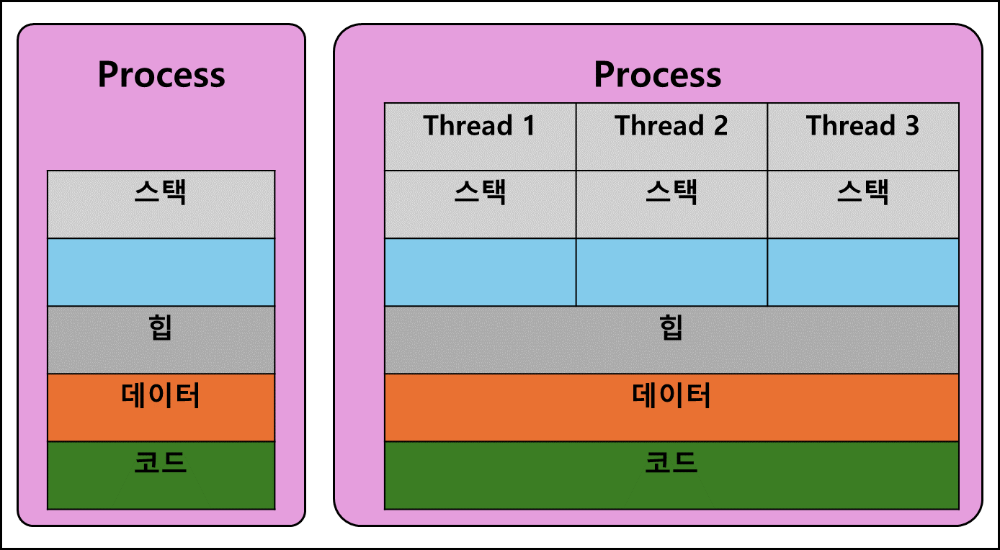
- 프로세스의 실행 가능한 가장 작은 단위
- 프로세스는 여러 스레드를 가질 수 있다.
- 스레드는 코드, 데이터, 힙을 서로 공유한다.
- TCB로 관리된다.  

❓TCB
```
Thread Control Block
스레드 ID
스레드 상태
CPU 정보
우선 순위
PCB를 가리키는 포인터
이 스레드가 생성한 스레드를 가리키는 포인터
stack 포인터
```
### 멀티스레딩
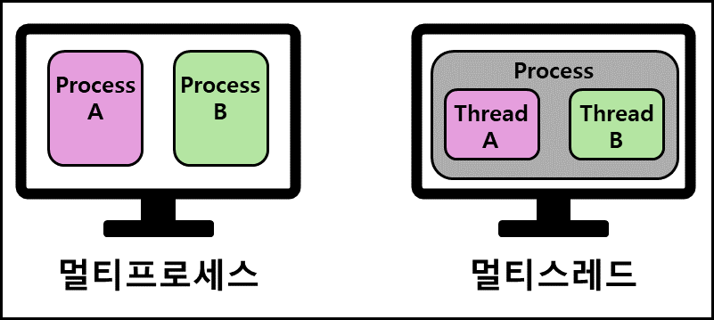
- 프로세스 내 작업을 여러 개의 스레드, 멀티 스레드로 처리하는 기법
- 스레드끼리 서로 자원 공유, 효율성⬆️

## 공유 자원과 임계 영역
### 공유 자원
- 시스템 안에서 각 프로세스, 스레드가 함께 접근할 수 있는 모니터, 프린터, 메모리, 파일, 데이터 등의 자원이나 변수
  #### 경쟁 상태(Race Condition)
  - 위 공유 자원을 두 개 이상의 프로세스가 동시에 읽거나 쓰는 상황

### 임계 영역(Critical Section)
- 둘 이상의 프로세스, 스레드가 공유 자원에 접근할 때 순서 등의 이유로 결과가 달라지는 코드 영역
  #### 해결하기 위한 방법
  - 뮤텍스
  - 세마포어
  - 모니터
  - 위 세가지 모두 상호 배제, 한정 대기, 융통성을 만족
- 위 세 가지 방법의 토대가 되는 메커니즘: **잠금(Lock)**
❓용어 정리
```
상호 배제
한 프로세스가 임계 영역에 들어갔을 때 다른 프로세스는 들어갈 수 없다.

한정 대기
특정 프로세스가 영원히 임계 영역에 들어가지 못하면 안 된다.

융통성
한 프로세스가 다른 프로세스의 일을 방해해서는 안 된다.
```

### 뮤텍스(Mutex)
- 공유 자원을 lock()을 통해 잠금 설정
- 사용한 후 unlock()을 통해 잠금 해제
- 바이너리 세마포어라고 할 수도 있음  

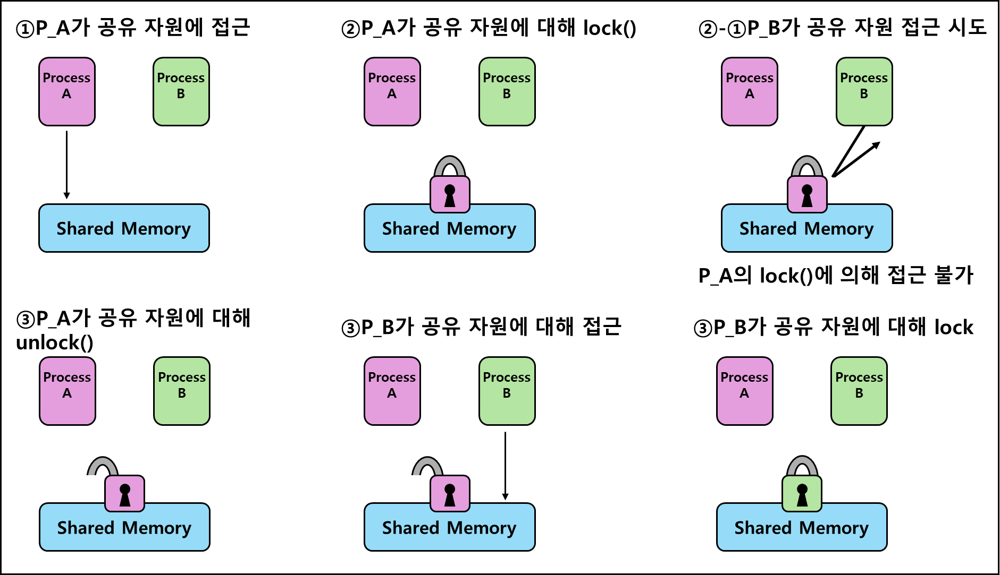


### 세마포어(Semaphore)
- 일반화된 뮤텍스
- 간단한 정수 값과 두 가지 함수 wait 및 signal로 공유 자원에 대한 접근을 처리
- 간단한 정수 값은 공유 자원에 접근할 수 있는 프로세스/스레드 수를 의미

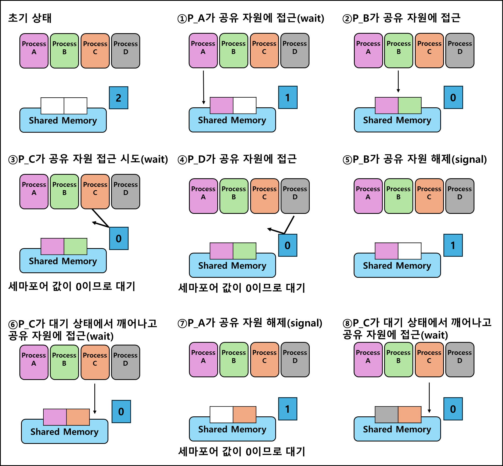

#### 바이너리 세마포어
- 세마포어가 0, 1 두 가지 값만 가질 수 있는 세마포어
- 구현의 유사성으로 인해 뮤텍스는 바이너리 세마포어라고 할 수 있다.  

  하지만!  
  |||
  |:--:|:--:|
  |뮤텍스|잠금 매커니즘|
  |세마포어|신호 메커니즘|
#### 카운팅 세마포어
- 여러 개의 값을 가질 수 있는 세마포어
- 여러 자원에 대한 접근을 제어

### 모니터
- 둘 이상의 스레드나 프로세스가 공유 자원에 안전하게 접근할 수 있도록 공유 자원을 숨기고 **인터페이스만 제공**
- 모니터큐를 통해 공유 자원에 대한 작업들을 순차적으로 처리

## 교착 상태(Deadlock)
- 두 개 이상의 프로세스들이 서로가 가진 자원을 기다리며 중단된 상태  

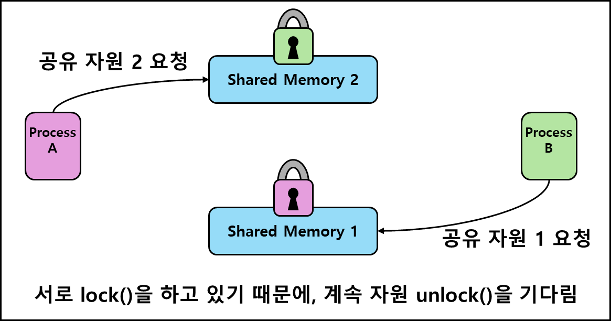
### 교착 상태 발생 조건
- 상호 배제(Mutual Exclusion)
  - 한 프로세스가 자원을 독점하고 있으며 다른 프로세스들은 접근이 불가능
  - 한번에 한 개의 프로세스만 공유자원 사용 가능
- 점유 대기(Hold and Wait)
  - 특정 프로세스가 점유한 자원을 다른 프로세스가 요청하는 상태
- 비선점(No Preemption)
  - 다른 프로세스의 자원을 강제적으로 가져올 수 없음
- 환형 대기(Circular Wait)
  - 프로세스 A는 프로세스 B의 자원을, 프로세스 B는 프로세스 A의 자원을 요구하는 상태

**교착 상태 발생 조건 4가지를 모두 만족할 때 교착 상태 발생**  
하나라도 만족하지 않는다면 교착 상태 발생 X

### 교착 상태 해결 방법
1. 자원을 할당할 때 애초에 조건이 성립되지 않도록 설계
2. 교착 상태 가능성이 없을 때만 자원 할당, 은행원 알고리즘 활용
3. 교착 상태가 발생하면 사이클이 있는지 탐색, 이후 관련된 프로세스를 한 개씩 제거  
4. 교착 상태 발생 시 작업 종료  
현대 운영체제는 교착 상태가 드물게 발생하고 처리 비용이 크기 때문에 작업을 종료한다.

---
References  
https://zangzangs.tistory.com/109  
https://blog.naver.com/iamsjy17/70154247479  
https://velog.io/@klm03025/%EC%9A%B4%EC%98%81%EC%B2%B4%EC%A0%9C-%ED%94%84%EB%A1%9C%EC%84%B8%EC%8A%A4-%EC%A3%BC%EC%86%8C-%EA%B3%B5%EA%B0%84
https://velog.io/@paki1019/%ED%94%84%EB%A1%9C%EC%84%B8%EC%8A%A4-%EC%A3%BC%EC%86%8C-%EA%B3%B5%EA%B0%84Process-Address-Space
https://jwprogramming.tistory.com/55
https://kimwooseok.com/cs/2022/03/10/Thread/
https://velog.io/@sweet_sumin/PCBTCB
https://eunajung01.tistory.com/55