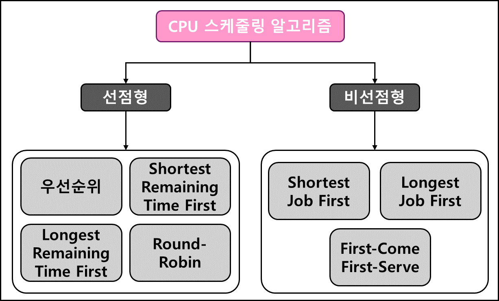
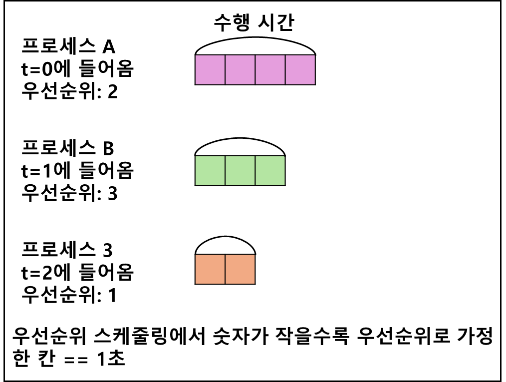
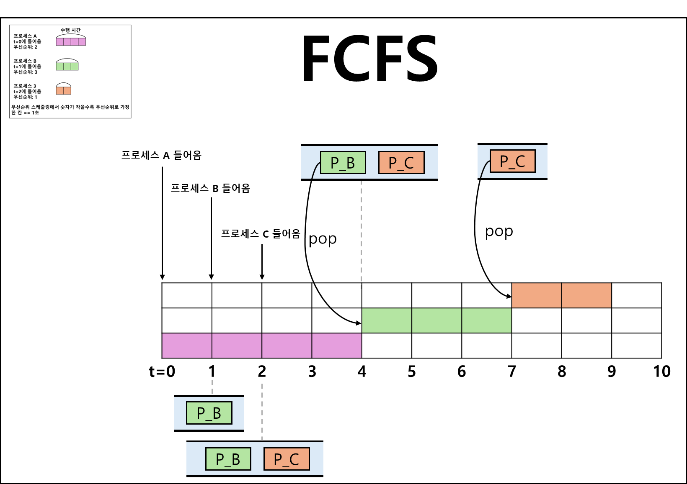
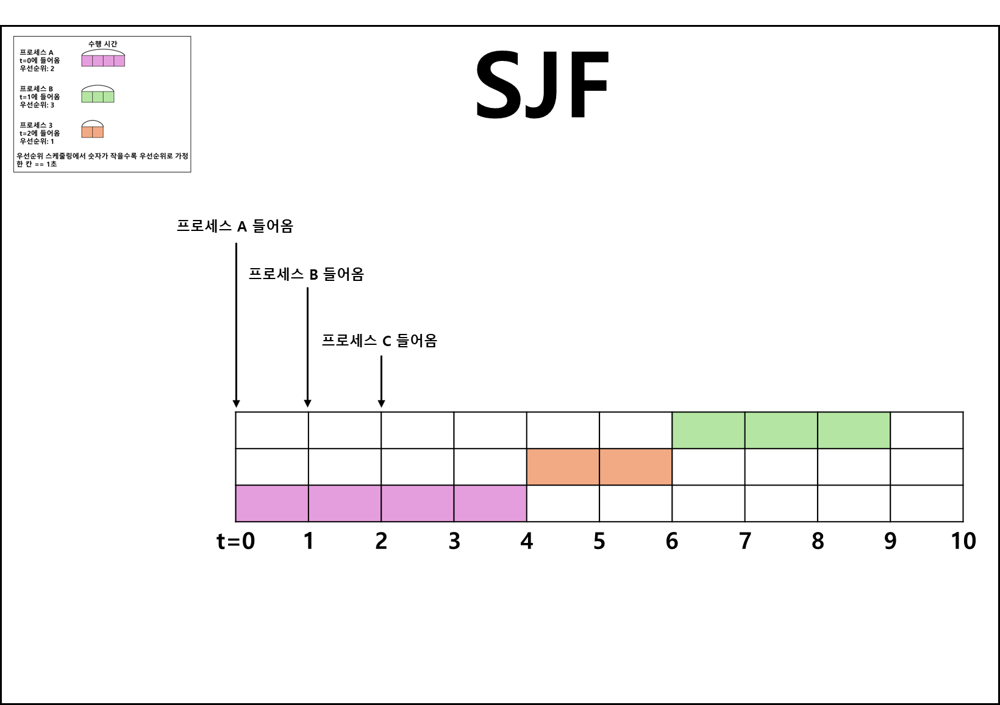
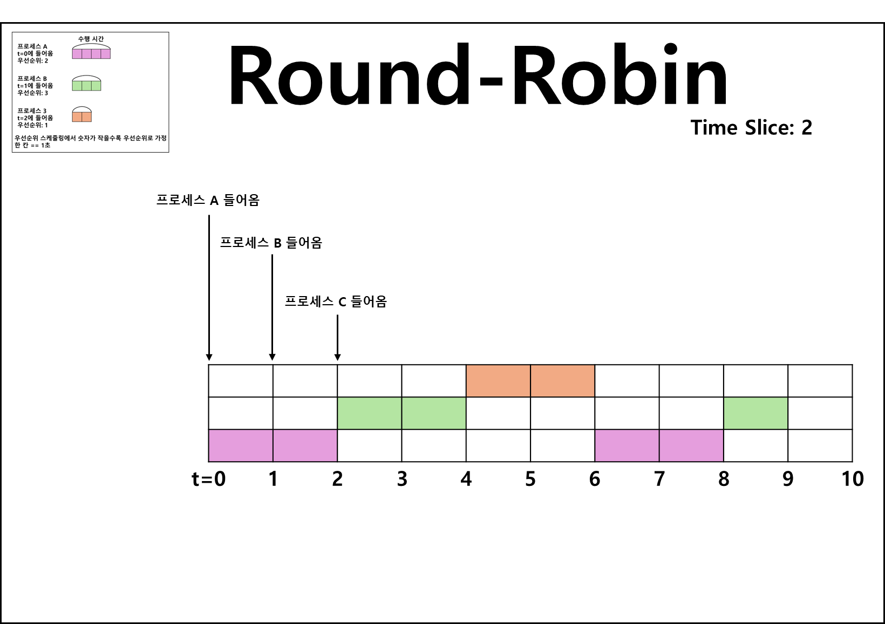
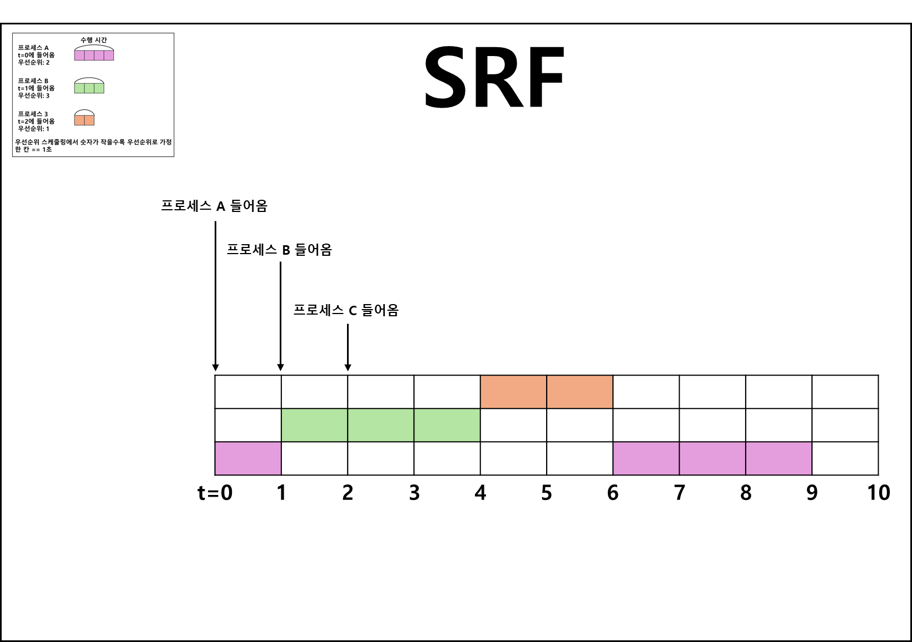
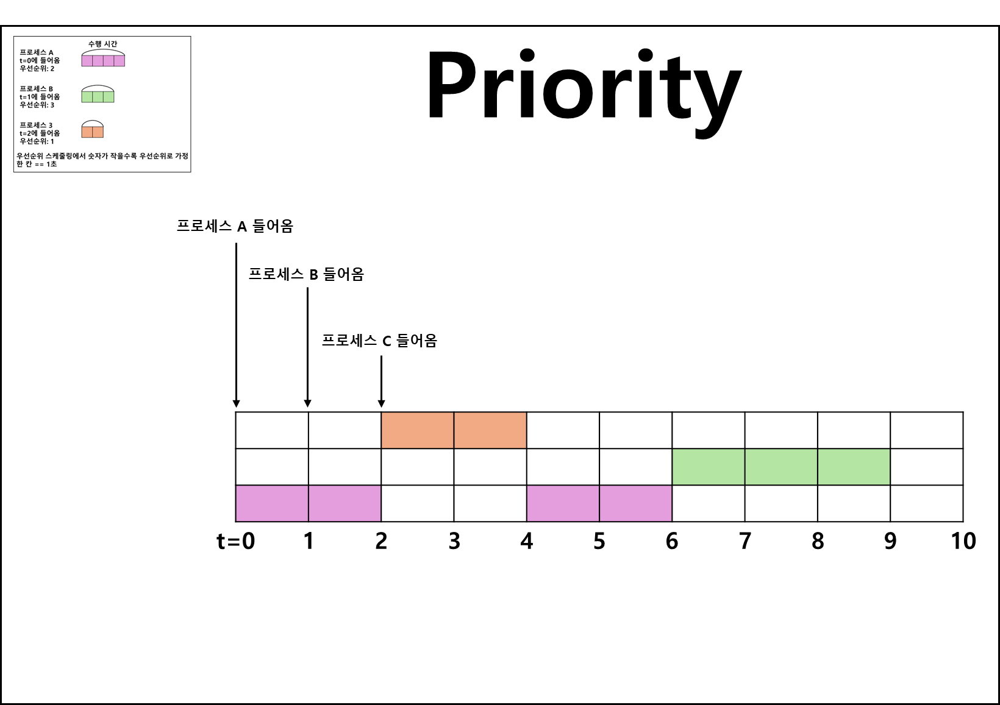

# CPU 스케줄링 알고리즘
### CPU 스케줄러는 CPU 스케줄링 알고리즘에 따라 프로세스에서 해야 하는 일을 스레드 단위로 CPU에 할당합니다
- CPU 스케줄링 알고리즘이 **어떤 프로그램에 CPU 소유권을 줄 것**인지 결정
- CPU 이용률을 높게, 주어진 시간에 많은 일을 하게, 준비 큐에 있는 프로세스는 적게, 응답 시간은 짧게 설정하는 것을 목표로 스케줄링  

# 비선점형 방식(non-preemptive)
- 프로세스가 스스로 CPU 소유권을 포기하는 방식
- 강제로 프로세스를 중지하지 않음
- 컨텍스트 스위칭으로 인한 부하가 적다

### FCFS(First-Come, First-Serve)
- 먼저 온 프로세스를 가장 먼저 처리하는 알고리즘
- 길게 수행되는 프로세스 때문에 준비 큐(Ready Queue)에서 오래 기다리는 현상(Convoy Effect) 발생

### SJF(Shortest Job First)
- 실행 시간이 가장 짧은 프로세스를 가장 먼저 실행하는 알고리즘
- 긴 시간을 가진 프로세스가 실행되지 않는 현상(Starvation) 발생
- 평균 대기 시간이 가장 짧다
- 실제 실행 시간을 알 수 없기 때문에 과거의 실행했던 시간을 토대로 추측하여 사용

#### Starvation을 해결하기 위해 우선순위 적용
- Ready Queue에서 오래된 작업일수록 **'우선순위를 높이는 방법(Aging)'**을 통해 단점 보완

### LJF(Longest Job First)
- 실행 시간이 가장 긴 프로세스를 가장 먼저 실행하는 알고리즘

# 선점형 방식(Preemptive)
- 프로세스를 알고리즘에 기반하여 중단
- 다른 프로세스에 CPU 소유권 할당

### 라운드 로빈(Round-Robin)
- 우선순위 스케줄링의 일종
- 각 프로세스는 동일한 할당 시간이 주어짐
- 해당 시간 안에 끝나지 않으면 다시 준비 큐(Ready Queue)의 뒤로 가는 알고리즘
- 일반적으로 전체 작업시간⬆️
- 평균 응답시간⬇️

### SRF(Shortest Remaining Time First)
- 프로세스 수행 중 더 짧은 작업이 들어오면 수행중이던 프로세스 중지
- 더 짧은 작업을 우선적으로 수행하는 알고리즘
### 우선순위
- 프로세스의 우선순위에 기반하여 수행중이던 프로세스 중지
- 우선순위가 더 높은 프로세스를 우선적으로 수행하는 알고리즘
### 다단계 큐(Multilevel Queue Scheduling)
- 프로세스 우선순위에 따라 준비 큐를 여러개 사용
- 각 큐에 대해 다른 스케줄링 알고리즘 적용
- 큐 간의 프로세스 이동이 안되므로 스케줄링 부담⬇️
- 유연성이 떨어짐

