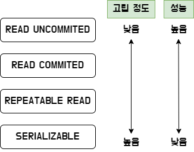
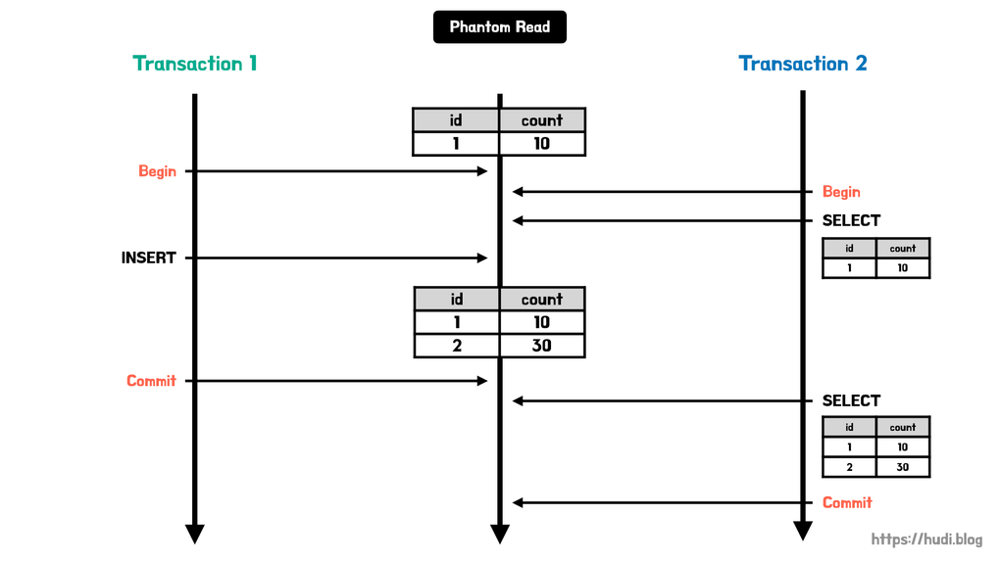

# 4.3 트랜잭션과 무결성
## 4.3.1 트랜잭션
- DB에서 하나의 논리적 기능을 수행하기 위한 작업의 단위
- 여러 개의 쿼리들을 하나로 묶는 단위
- 원자성, 일관성, 독립성, 지속성

### 원자성(atomicity)
> "all or nothing"

트랜잭션 관련 일이 모두 수행되었거나 되지 않았거나를  보장하는 특징
- 외부 API를 호출하는 것이 만약 있다면 롤백이 일어났을 때 어떻게 해야하는지 해결 방법, 트랜잭션 전파 관리 필요

#### 커밋(commit)
여러 쿼리가 성공적 처리되었음을 확정하는 명령어
- 커밋 시작, 트랜잭션, 커밋 종료 순으로 진행

#### 롤백(rollback)
에러, 이슈로 트랜잭션이 일어나기 전으로 돌리는 일

❓커밋과 롤백의 필요성
```
- 데이터의 무결성 보장
- 데이터 변경 전 변경 사항 쉽게 확인 및 그룹화
```

❓무결성
```
데이터의 정확성, 일관성, 유효성을 유지하는 것
무결성이 유지되어야 DB의 값에 신뢰가 생김

개체 무결성: 기본 키는 빈 값 불가ㅣ
참조 무결성: 참조 관계의 데이터는 항상 일관된 값 유지 필요
고유 무결성: 고유성에 대한 조건이 주어진 경우 그 속성 값은 모두 고유성을 가짐
NULL 무결성: NULL이 올 수 없다는 조건이 주어진 경우 그 속성 값은 NULL이 될 수 없음
```


#### 트랜잭션 전파
여러 트랜잭션 관련 메소드 호출을 하나의 트랜잭션에 묶이도록 하는 것
- 예) Spring의 @Transactional

### 일관성(consistency)
허용된 방식으로만 데이터를 변경해야 하는 것
- 예) 0원이 있는 범석이가 홍철이에게 500만원을 입금할 수 없음

### 격리성(isolation)
트랜잭션 수행 시 서로 끼어들지 못하는 것
<br>


- 위로 갈수록 동시성이 강해지지만 격리성은 낮아짐

### 트랜잭션 격리 수준에 따라 발생할 수 있는 문제점
- READ_UNCOMMITTED:  팬텀 리드, 반복 가능하지 않은 조회, 더티 리드
- READ_COMMITTED: 팬텀 리드, 반복 가능하지 않은 조회
- REPEATABLE_READ: 팬텀 리드

#### 팬텀 리드(phantom read)
- 한 트랜잭션 내에서 동일 쿼리를 보냈을 때 해당 조회 결과가 다른 경우
- 조회해온 결과의 행이 새로 생기거나 없어지는 현상



#### 반복 가능하지 않은 조회
- 한 트랜잭션 내의 같은 행에 두 번 이상 조회가 발생했는데 그 값이 다른 경우

❓팬텀 리드, 반복 가능하지 않은 조회 차이
```
- 팬텀 리드: 다른 행이 선택될 수 있음
- 반복 가능하지 않은 조회: 행 값이 달라질 수 있음
```

#### 더티 리드(dirty read)
- 한 트랜잭션이 실행 중일 때 다른 트랜잭션에 의해 수정되었지만 아직 커밋되지 않은 행의 데이터를 읽는 것

### 격리 수준
#### SERIALIZABLE
- 트랜잭션 순차 처리
- 같은 행 동시 접근 불가
- 교착 상태 일어날 확률 높고, 성능이 가장 떨어짐

#### REPEATABLE_READ
- 하나의 트랜잭션이 수정한 행을 다른 트랜잭션이 수정할 수 없도록 하지만 새로운 행을 추가하는 것은 막지 않음

#### READ_COMMITTED
- 가장 많이 사용되는 격리 수준(PostgreSQL, SQL Server, 오라클)
- 다른 트랜잭션이 커밋하지 않은 정보를 읽을 수 없음
- 어떤 트랜잭션이 접근한 행을 다른 트랜잭션이 수정할 수 있음

#### READ_UNCOMMITTED
- dirty read 발생 가능성으로 데이터 무결성을 위해 되도록 사용하지 않는 것이 이상적
- 거대한 데이터를 '어림잡아' 집계 시 사용

### 지속성(durability)
성공적으로 수행된 트랜잭션은 영원히 반영되어야 하는 것
- DB 시스템 장애 시에도 원래 상태로 복구하는 회복 기능 필요
- 체크섬, 저널링, 롤백 기능

#### 체크섬
중복 검사의 한 형태, 오류 정정을 위해 송신된 자료의 무결성을 보호하는 단순한 방법

#### 저널링
commit 전에  로깅하는 것


#### 참고
https://velog.io/@yu-jin-song/DB-%ED%8A%B8%EB%9E%9C%EC%9E%AD%EC%85%98-%EA%B2%A9%EB%A6%AC-%EC%88%98%EC%A4%80Transaction-Isolation-Level

https://hudi.blog/transaction-isolation-level/